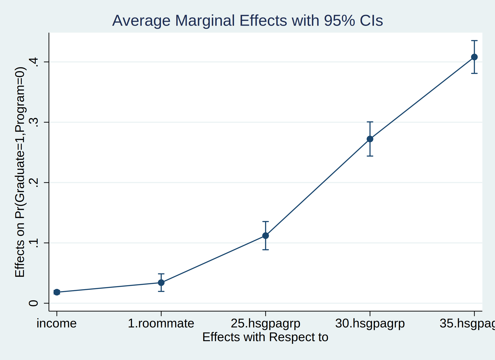

# rbiprobit
## Stata module to estimate recursive bivariate probit regressions

### __Table of Contents__
1. [Model Estimation](#1-model-estimation)
2. [Conventional Postestimation Commands](#2-conventional-postestimation-commands)
3. [Treatment Effects](#3-treatment-effects)
4. [Marginal Effects](#4-marginal-effects)
5. [Examples](#5-examples)
6. [References](#6-references)
7. [About](#7-about)
8. [How to install](#8-how-to-install)
9. [Changelog](#9-changelog)

## 1. Model Estimation

`rbiprobit` is a user-written command that fits a recursive bivariate probit regression using maximum likelihood estimation. It is implemented as an `lf1` ml evaluator. The model involves an outcome equation with the dependent variable _depvar_ and a treatment equation with the dependent variable _depvar_en_. Both dependent variables _depvar_ and _depvar_en_ have to be binary and coded as 0/1 variables.

#### Syntax

```git
rbiprobit depvar [=] [indepvars] [if] [in] [weight], endogenous(depvar_en [=] [indepvars_en] [, enopts]) [options]
```

where _depvar_ is the outcome variable, _indepvars_ are the independent variables of the outcome equation, _depvar_en_ is the treatment variable, and _indepvars_en_ are the independent variables of the treatment equation. `rbiprobit` automatically adds the treatment variable _depvar_en_ as an independent variable on the right-hand side of the outcome equation. Independent variables may contain factor variables and may be different or the same. All variables may contain time-series operators. `rbiprobit` is limited to a recursive model with two equations and provides two tailored postestimation commands and some common Stata postestimation commands.

#### Options

    options                       Description
    -----------------------------------------------------------------------------------------------------------
    Model
      noconstant                  suppress constant term
      offset(varname)             offset variable for outcome equation
      constraints(constraints)    apply specified linear constraints
      collinear                   keep collinear variables

    SE/Robust
      vce(vcetype)                vcetype may be oim, robust, cluster clustvar, opg, bootstrap, or jackknife

    Reporting
      level(#)                    set confidence level; default is level(95)
      lrmodel                     perform likelihood-ratio model test instead of the default Wald test
      nocnsreport                 do not display constraints
      display_options             control columns and column formats, row spacing, line width, display of
                                    omitted variables and base and empty cells, and factor-variable labeling

    Maximization
      maximize_options            control the maximization process; seldom used

      coeflegend                  display legend instead of statistics
    -----------------------------------------------------------------------------------------------------------

    enopts                        Description
    -----------------------------------------------------------------------------------------------------------
    Model
      noconstant                  suppress constant term
      offset(varname)             offset variable for treatment equation
    -----------------------------------------------------------------------------------------------------------


## 2. Conventional Postestimation Commands

As for the `biprobit` or `probit` commands, there are a set of common postestimation commands available for testing hypotheses, obtaining model statistics, predicting responses and saving estimation results.


    Command            Description
    -----------------------------------------------------------------------------------------------------------
      contrast         contrasts and ANOVA-style joint tests of estimates
      estat ic         Akaike's and Schwarz's Bayesian information criteria (AIC and BIC)
      estat summarize  summary statistics for the estimation sample
      estat vce        variance-covariance matrix of the estimators (VCE)
      estat (svy)      postestimation statistics for survey data
      estimates        cataloging estimation results
    * hausman          Hausman's specification test
      lincom           point estimates, standard errors, testing, and inference for linear combinations of
                         coefficients
    * lrtest           likelihood-ratio test
      nlcom            point estimates, standard errors, testing, and inference for nonlinear combinations of
                         coefficients
      predict          predictions, residuals, influence statistics, and other diagnostic measures
      predictnl        point estimates, standard errors, testing, and inference for generalized predictions
      pwcompare        pairwise comparisons of estimates
      test             Wald tests of simple and composite linear hypotheses
      testnl           Wald tests of nonlinear hypotheses
    -----------------------------------------------------------------------------------------------------------
    * hausman and lrtest are not appropriate with svy estimation results.


#### __Syntax for predict__

```git
predict [type] newvar [if] [in] [, statistic nooffset]

predict [type] {stub*|newvar_eq1 newvar_eq2 newvar_atanrho} [if] [in] , scores
```
`predict` creates a new variable containing predictions such as probabilities, linear indexes, and standard errors. The following statistics are available both in and out of sample; type `predict ... if e(sample) ...` if wanted only for the estimation sample.

        statistic          Description
        --------------------------------------------------------------------------------------------------
        Main
          p11              Pr(depvar=1, depvar_en=1); the default
          p10              Pr(depvar=1, depvar_en=0)
          p01              Pr(depvar=0, depvar_en=1)
          p00              Pr(depvar=0, depvar_en=0)
          pmarg1           Pr(depvar=1); marginal success probability for outcome equation
          pmarg2           Pr(depvar_en=1); marginal success probability for treatment equation
          pcond1           Pr(depvar=1 | depvar_en=1)
          pcond2           Pr(depvar_en=1 | depvar=1)
          xb1              linear prediction for outcome equation
          xb2              linear prediction for treatment equation
          stdp1            standard error of the linear prediction for outcome equation
          stdp2            standard error of the linear prediction for treatment equation
        --------------------------------------------------------------------------------------------------


## 3. Treatment Effects

```git
rbiprobit tmeffects [if] [in] [weight] [, options]
```

`rbiprobit tmeffects` estimates the average treatment effect, average treatment effect on the treated, and the average treatment effect on the conditional probability

#### Options


    options                 Description
    -----------------------------------------------------------------------------------------------------------
    Main
      tmeffect(effecttype)  specify type of treatment effect; effecttype may be ate, atet, or atec; default is
                              ate
    SE
      vce(delta)            estimate SEs using delta method; the default
      vce(unconditional)    estimate SEs allowing for sampling of covariates

    Advanced
      noweights             ignore weights specified in estimation
      noesample             do not restrict rbiprobit tmeffects to the estimation sample
      force                 estimate treatment effects despite potential problems

    Reporting
      level(#)              set confidence level; default is level(95)
      post                  post margins and their VCE as estimation results
      display_options       control columns and column formats, row spacing, line width, and factor-variable
                              labeling
    -----------------------------------------------------------------------------------------------------------
    pweights, fweights, and iweights are allowed; see weight.


#### Description of `tmeffect()`

`tmeffect(effecttype)` specifies the type of the treatment effect of the treatment variable _depvar_en_ on a specific response.

Effecttype | Description
-----------| -----------
`ate`  |  `rbiprobit tmeffects` reports the __average treatment effect__, i.e. the finite difference between Pr(depvar=1) given depvar_en=1 and Pr(depvar=1) given depvar_en=0. Thus, ate is the difference between the marginal probability of outcome success given treatment success and the marginal probability of outcome success given treatment failure.
`atet`  |  `rbiprobit tmeffects` reports the __average treatment effect on the treated__, i.e. the finite difference between normal(depvar=1\|depvar_en=1) and normal(depvar=1\|depvar_en=0), computed and averaged only for the treated observations. Thus, atet is the difference between the marginal probability of outcome success conditioned on treatment success and the marginal probability of outcome success conditioned on treatment failure.
`atec`  | `rbiprobit tmeffects` reports the average treatment effect on the conditional probability, i.e. the finite difference between Pr(depvar=1\|depvar_en=1) and Pr(depvar=1\|depvar_en=0). Thus, atec is the difference between the conditional (on treatment success) probability of outcome success and the conditional (on treatment failure) probability of outcome success.


## 4. Marginal Effects

```git
rbiprobit margdec [if] [in] [weight] [, response_options options]
```

Margins are statistics calculated from predictions of a previously fit model by `rbiprobit` at fixed values of some covariates and averaging or otherwise integrating over the remaining covariates. The `rbiprobit margdec` command estimates margins of responses for specified values of independent variables in indepvars and indepvars_en and presents the results as a table.

Capabilities include estimated marginal means, least-squares means, average and conditional marginal and partial effects (which may be reported as derivatives or as elasticities), average and conditional adjusted predictions, and predictive margins. For estimation of margins of responses for specified values of the treatment variable _depvar_en_, please use `rbiprobit tmeffects`. `rbiprobit margdec` won't deliver results in this case.


#### <p style="color:red">CAUTION: Limitations of `margins` after rbiprobit</p>

Do not use `margins` after you have fit your model by using `rbiprobit` if your are interested in marginal means, predictive margins, marginal effects or average marginal effects. `margins` doesn't account for the recursive nature of the model and will deliver __incorrect point estimates__ and / or __incorrect standard errors__ of the point estimates.

Instead, use the postestimation commands `rbiprobit margdec` and `rbiprobit tmeffects` written explicitly for `rbiprobit`. They cover some but not all options of `margins` and will deliver correct point estimates and standard errors.


#### Options

    response_options        Description
    -----------------------------------------------------------------------------------------------------------
    Main
      effect(effecttype)    specify type of effect for margins; effecttype may be total, direct, or indirect;
                              default is total
      predict(pred_opt)     estimate margins for predict, pred_opt
      dydx(varlist)         estimate marginal effect of variables in varlist
      eyex(varlist)         estimate elasticities of variables in varlist
      dyex(varlist)         estimate semielasticity -- d(y)/d(lnx)
      eydx(varlist)         estimate semielasticity -- d(lny)/d(x)
    -----------------------------------------------------------------------------------------------------------

    options                 Description
    -----------------------------------------------------------------------------------------------------------
    SE
      vce(delta)            estimate SEs using delta method; the default
      vce(unconditional)    estimate SEs allowing for sampling of covariates

    Advanced
      noweights             ignore weights specified in estimation
      noesample             do not restrict rbiprobit margdec to the estimation sample
      force                 estimate margins despite potential problems

    Reporting
      level(#)              set confidence level; default is level(95)
      post                  post margins and their VCE as estimation results
      display_options       control columns and column formats, row spacing, line width, and factor-variable
                              labeling
    -----------------------------------------------------------------------------------------------------------

    Time-series operators are allowed if they were used in the estimation.
    pweights, fweights, and iweights are allowed; see weight.


#### Description of `effect()`

`effect(effecttype)` specifies the _effecttype_ for the margins. Once independent variables are parts of _indepvars_ and _indepvars_en_, marginal effects can be splitted into a __direct__ and an __indirect__ marginal effect.

Effecttype | Description
-----------| -----------
`effect(total)`  |  rbiprobit margdec reports derivatives of the response with respect to varlist in `dydx(varlist)`, `eyex(varlist)`, `dyex(varlist)`, or `eydx(varlist)`, considering the incorporation of varlist in _indepvars_ and/or _indepvars_en_.
`effect(direct)`  |  rbiprobit margdec reports derivatives of the response with respect to varlist from `dydx(varlist)`, `eyex(varlist)`, `dyex(varlist)`, or `eydx(varlist)`, considering only the incorporation of varlist in _indepvars_ and not taking into account the appearance of varlist in _indepvars_en_.
`effect(indirect)`  | rbiprobit margdec reports derivatives of the response with respect to varlist from `dydx(varlist)`, `eyex(varlist)`, `dyex(varlist)`, or `eydx(varlist)`, considering only the incorporation of varlist in _indepvars_en_ and not taking into account the appearance of varlist in _indepvars_.


## 5. Examples

#### Examples for `rbiprobit`

Setup

    . webuse class10, clear
    (Class of 2010 profile)

Estimation of a __recursive bivariate probit model__

    . rbiprobit graduate = income i.roommate i.hsgpagrp, ///
    >         endog(program = i.campus i.scholar income i.hsgpagrp)

    Univariate Probits for starting values

    Fitting comparison outcome equation:

    Iteration 0:   log likelihood = -1670.5207
    Iteration 1:   log likelihood = -1174.1089
    Iteration 2:   log likelihood = -1163.4298
    Iteration 3:   log likelihood =  -1161.967
    Iteration 4:   log likelihood = -1161.8185
    Iteration 5:   log likelihood =  -1161.791
    Iteration 6:   log likelihood = -1161.7856
    Iteration 7:   log likelihood = -1161.7844
    Iteration 8:   log likelihood = -1161.7843
    Iteration 9:   log likelihood = -1161.7842

    Fitting comparison treatment equation:

    Iteration 0:   log likelihood = -1724.5355
    Iteration 1:   log likelihood = -1512.2212
    Iteration 2:   log likelihood = -1512.0846
    Iteration 3:   log likelihood = -1512.0846

    Comparison:    log likelihood = -2673.8688

    Fitting full model:

    Iteration 0:   log likelihood = -2673.8688
    Iteration 1:   log likelihood = -2668.4481
    Iteration 2:   log likelihood = -2667.5279
    Iteration 3:   log likelihood = -2667.5268
    Iteration 4:   log likelihood = -2667.5268

    Recursive Bivariate Probit Regression           Number of obs     =      2,500
                                                    Wald chi2(12)     =     964.09
    Log likelihood = -2667.5268                     Prob > chi2       =     0.0000

    ------------------------------------------------------------------------------
                 |      Coef.   Std. Err.      z    P>|z|     [95% Conf. Interval]
    -------------+----------------------------------------------------------------
    graduate     |
       1.program |   .3523738   .1770068     1.99   0.047     .0054469    .6993008
          income |   .1434894   .0142907    10.04   0.000     .1154801    .1714986
                 |
        roommate |
            yes  |   .2677249   .0588581     4.55   0.000     .1523652    .3830846
                 |
        hsgpagrp |
        2.5-2.9  |   .9452083   .1357887     6.96   0.000     .6790673    1.211349
        3.0-3.4  |   1.939595   .1473241    13.17   0.000     1.650845    2.228345
        3.5-4.0  |   7.386042   1173.021     0.01   0.995    -2291.692    2306.464
                 |
           _cons |   -2.07643    .218118    -9.52   0.000    -2.503934   -1.648927
    -------------+----------------------------------------------------------------
    program      |
          campus |
            yes  |   .7465612   .0747099     9.99   0.000     .6001325    .8929898
                 |
         scholar |
            yes  |   .9008357   .0579883    15.53   0.000     .7871807    1.014491
          income |  -.0785839   .0096477    -8.15   0.000     -.097493   -.0596748
                 |
        hsgpagrp |
        2.5-2.9  |   .0586837   .1099656     0.53   0.594    -.1568448    .2742123
        3.0-3.4  |   .0652028   .1152077     0.57   0.571    -.1606001    .2910057
        3.5-4.0  |  -.0972943   .1780768    -0.55   0.585    -.4463184    .2517297
                 |
           _cons |  -.4442418   .1276996    -3.48   0.001    -.6945284   -.1939552
    -------------+----------------------------------------------------------------
        /atanrho |   .4137752   .1189211     3.48   0.001     .1806942    .6468562
    -------------+----------------------------------------------------------------
             rho |   .3916735   .1006776                       .178753    .5695498
    ------------------------------------------------------------------------------
    Wald test of rho=0: chi2(1) = 12.1063                     Prob > chi2 = 0.0005


Report __likelihood-ratio test__ instead of Wald test

    Recursive Bivariate Probit Regression           Number of obs     =      2,500
                                                    LR chi2(11)       =    1370.36
    Log likelihood = -2667.5268                     Prob > chi2       =     0.0000

    ------------------------------------------------------------------------------
                 |      Coef.   Std. Err.      z    P>|z|     [95% Conf. Interval]
    -------------+----------------------------------------------------------------
    graduate     |
       1.program |   .3523808   .1770055     1.99   0.047     .0054564    .6993053
          income |   .1434898   .0142906    10.04   0.000     .1154807     .171499
                 |
        roommate |
            yes  |   .2677256   .0588581     4.55   0.000     .1523657    .3830854
                 |
        hsgpagrp |
        2.5-2.9  |   .9452102   .1357888     6.96   0.000      .679069    1.211351
        3.0-3.4  |   1.939599   .1473239    13.17   0.000      1.65085    2.228349
        3.5-4.0  |   7.425192   1310.137     0.01   0.995    -2560.396    2575.247
                 |
           _cons |  -2.076439   .2181168    -9.52   0.000     -2.50394   -1.648938
    -------------+----------------------------------------------------------------
    program      |
          campus |
            yes  |    .746563   .0747099     9.99   0.000     .6001343    .8929918
                 |
         scholar |
            yes  |   .9008381   .0579883    15.53   0.000     .7871832    1.014493
          income |  -.0785838   .0096477    -8.15   0.000     -.097493   -.0596747
                 |
        hsgpagrp |
        2.5-2.9  |   .0586843   .1099656     0.53   0.594    -.1568443    .2742128
        3.0-3.4  |   .0652038   .1152077     0.57   0.571    -.1605991    .2910067
        3.5-4.0  |  -.0972944   .1780768    -0.55   0.585    -.4463185    .2517297
                 |
           _cons |  -.4442449   .1276996    -3.48   0.001    -.6945315   -.1939582
    -------------+----------------------------------------------------------------
        /atanrho |   .4137682   .1189199     3.48   0.001     .1806895    .6468468
    -------------+----------------------------------------------------------------
             rho |   .3916675   .1006772                      .1787484    .5695434
    ------------------------------------------------------------------------------
    Wald test of rho=0: chi2(1) = 12.1061                     Prob > chi2 = 0.0005


__Prediction__ after `rbiprobit`

    . qui: rbiprobit graduate = income i.roommate i.hsgpagrp, ///
    >         endog(program = i.campus i.scholar income i.hsgpagrp)

    . predict p11, p11
    . predict p1, pmarg1
    . predict pcond1, pcond1

    . sum p11 p1 pcond1

        Variable |        Obs        Mean    Std. Dev.       Min        Max
    -------------+---------------------------------------------------------
             p11 |      2,500    .3759793    .1683146   .0348119   .8205418
              p1 |      2,500    .6134214    .2680251   .0284513          1
          pcond1 |      2,500    .7313554    .2417841   .0859672          1


#### Examples for `rbiprobit margdec`

Setup

    . webuse class10, clear
    (Class of 2010 profile)

    . rbiprobit graduate = income i.roommate i.hsgpagrp, ///
    >         endog(program = i.campus i.scholar income i.hsgpagrp)

Compute __total average marginal effects__ of _income_ on the joint probability Pr(depvar=1, depvar_en=1)

    . rbiprobit margdec, dydx(income) effect(total) predict(p11)

    Average marginal effects                        Number of obs     =      2,500
    Model VCE    : OIM

    Expression   : Pr(graduate=1,program=1), predict(p11)
    dy/dx w.r.t. : income

    ------------------------------------------------------------------------------
                 |            Delta-method
                 |      dy/dx   Std. Err.      z    P>|z|     [95% Conf. Interval]
    -------------+----------------------------------------------------------------
          income |   .0032146    .002856     1.13   0.260    -.0023831    .0088123
    ------------------------------------------------------------------------------

Compute __direct average marginal effects__ of _income_ on the joint probability Pr(depvar=1, depvar_en=1)

    . rbiprobit margdec, dydx(income) effect(direct) predict(p11)

    Average marginal effects                        Number of obs     =      2,500
    Model VCE    : OIM

    Expression   : Pr(graduate=1,program=1), predict(p11)
    dy/dx w.r.t. : income

    ------------------------------------------------------------------------------
                 |            Delta-method
                 |      dy/dx   Std. Err.      z    P>|z|     [95% Conf. Interval]
    -------------+----------------------------------------------------------------
          income |   .0207027   .0017927    11.55   0.000     .0171891    .0242163
    ------------------------------------------------------------------------------

Compute __indirect average marginal effects__ of _income_ on the joint probability Pr(depvar=1, depvar_en=1)

    . rbiprobit margdec, dydx(income) effect(indirect) predict(p11)

    Average marginal effects                        Number of obs     =      2,500
    Model VCE    : OIM

    Expression   : Pr(graduate=1,program=1), predict(p11)
    dy/dx w.r.t. : income

    ------------------------------------------------------------------------------
                 |            Delta-method
                 |      dy/dx   Std. Err.      z    P>|z|     [95% Conf. Interval]
    -------------+----------------------------------------------------------------
          income |  -.0174881     .00214    -8.17   0.000    -.0216825   -.0132937
    ------------------------------------------------------------------------------

Compute indirect average marginal effects of __all__ independent variables on the joint probability
Pr(depvar=1, depvar_en=0) and __plot__ the results

    . rbiprobit margdec, dydx(*) predict(p10) effect(direct)

    Average marginal effects                        Number of obs     =      2,500
    Model VCE    : OIM

    Expression   : Pr(graduate=1,program=0), predict(p10)
    dy/dx w.r.t. : income 1.roommate 25.hsgpagrp 30.hsgpagrp 35.hsgpagrp

    ------------------------------------------------------------------------------
                 |            Delta-method
                 |      dy/dx   Std. Err.      z    P>|z|     [95% Conf. Interval]
    -------------+----------------------------------------------------------------
          income |   .0182909   .0015035    12.17   0.000     .0153442    .0212377
                 |
        roommate |
            yes  |   .0341482   .0074305     4.60   0.000     .0195847    .0487117
                 |
        hsgpagrp |
        2.5-2.9  |    .112039   .0119239     9.40   0.000     .0886686    .1354094
        3.0-3.4  |   .2722564   .0144549    18.83   0.000     .2439253    .3005875
        3.5-4.0  |   .4081472   .0138709    29.42   0.000     .3809608    .4353337
    ------------------------------------------------------------------------------
    Note: dy/dx for factor levels is the discrete change from the base level.

    . marginsplot





#### Examples for `rbiprobit tmeffects`

Setup

    . webuse class10, clear
    (Class of 2010 profile)

    . rbiprobit graduate = income i.roommate i.hsgpagrp, ///
    >         endog(program = i.campus i.scholar income i.hsgpagrp)

Compute the __average treatment effect__ of program

    . rbiprobit tmeffects, tmeffect(ate)

    Treatment effect                                Number of obs     =      2,500
    Model VCE    : OIM

    Expression   : Pr(graduate=1), predict(pmarg1)
    Effect       : Average treatment effect
    dydx w.r.t.  : 1.program

    ------------------------------------------------------------------------------
                 |            Delta-method
                 |      dy/dx   Std. Err.      z    P>|z|     [95% Conf. Interval]
    -------------+----------------------------------------------------------------
             ate |   .0981665   .0476222     2.06   0.039     .0048287    .1915044
    ------------------------------------------------------------------------------


Compute the __average treatment effect on the treated__ of program

    . rbiprobit tmeffects, tmeffect(atet)

    Treatment effect                                Number of obs     =      1,352
    Model VCE    : OIM

    Expression   : normal(graduate=1|program=1) - normal(graduate=1|program=0)
    Effect       : Average treatment effect on the treated
    dydx w.r.t.  : 1.program

    ------------------------------------------------------------------------------
                 |            Delta-method
                 |      dy/dx   Std. Err.      z    P>|z|     [95% Conf. Interval]
    -------------+----------------------------------------------------------------
            atet |    .103389   .0510323     2.03   0.043     .0033676    .2034105
    ------------------------------------------------------------------------------


Compute __average treatment effects on the conditional probability__ of program

    . rbiprobit tmeffects, tmeffect(atec)

    Treatment effect                                Number of obs     =      2,500
    Model VCE    : OIM

    Expression   : Pr(graduate=1|program=1)-Pr(graduate=1|program=0), predict(pcond1)-predict(pcond10)
    Effect       : Average treatment effect on conditional probability
    dydx w.r.t.  : 1.program

    ------------------------------------------------------------------------------
                 |            Delta-method
                 |      dy/dx   Std. Err.      z    P>|z|     [95% Conf. Interval]
    -------------+----------------------------------------------------------------
            atec |   .2765766   .0164367    16.83   0.000     .2443614    .3087919
    ------------------------------------------------------------------------------


## 6. References

[Coban, M. (2020)](http://doku.iab.de/discussionpapers/2020/dp2320.pdf). Redistribution Preferences, Attitudes towards Immigrants, and Ethnic Diversity, IAB Discussion Paper 2020/23.

Greene, W.H. (2018). Econometric Analysis, 8th Edition, Pearson.

[Hasebe, T. (2013)](https://doi.org/10.1016/j.econlet.2013.08.028). Marginal effects of a bivariate binary choice model, Economic Letters 121(2), pp. 298-301.

## 7. About

__Mustafa Coban__\
Institute for Employment Research (Germany)

email:         mustafa.coban@iab.de\
github:        [github.com/cobanomics](https://github.com/cobanomics)\
webpage:       [mustafacoban.de](https://www.mustafacoban.de)


## 8. How to Install

The latest version can be obtained via
```git
ssc install rbiprobit
```
or
```git
net install rbiprobit, from("https://cobanomics.github.io/rbiprobit/")
```

## 9. Changelog

__18apr2022 (version 1.1.0)__
* `rbiprobit`
  * `bootstrap`, `jackknife` and `svy` as prefix allowed
  * `pweights`, `fweights`, and `iweights` allowed
  * new model options `noconstant`, `offset`, and `constraints` integrated
  * all common `vce()` options available
  * likelihood-ratio model test implemented

* `rbiprobit margdec`
  * advanced options included
  * options for different standard error calculation included; similar to `margins`

* `rbiprobit tmeffects`
  * advanced options included
  * options for different standard error calculations included; similar to `margins`
